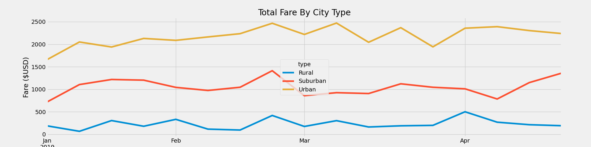

# PyBer_Analysis
## Project Overview
We have been asked to analyse ride-sharing data by our manager to underdtand performance. We looked over ride and city data, merging them into a single dataframe and then using groupby and loc functions in Pandas for some statistical analysis for Urban, Suburban, and Rural areas. We also looked at average fare per driver, per ride, and per city for each type of area. We will use matplotlib to share our findings.

## Results

It came as no surprise that suburban ride-share income was higher than rural income, and that urban income was higher than suburban income. This was true for the entire year of data collection (2019) and each subsequent week. The results for the cost per ride and driver are opposite: fares decrease in more populated areas with more options and drivers available. Given that the number of rides in urban areas is ten times higher than in rural areas and almost triples that in suburban areas, it stands to reason that people would take shorter rides at lower prices, or even offered at lower rates, given that there is more supply than demand.

## Conclusion
 - The overall income levels of suburban areas are quite high, so it may be necessary to continue expanding in this area.
 - With more than twice as many drivers as rides in urban areas, cutting back on drivers or moving them to the suburbs or the reral areas could save money.
 - In rural areas, drivers are likely to earn more per driver on average. This could be a useful indicator for drivers to help bring supply and demand into balance.
